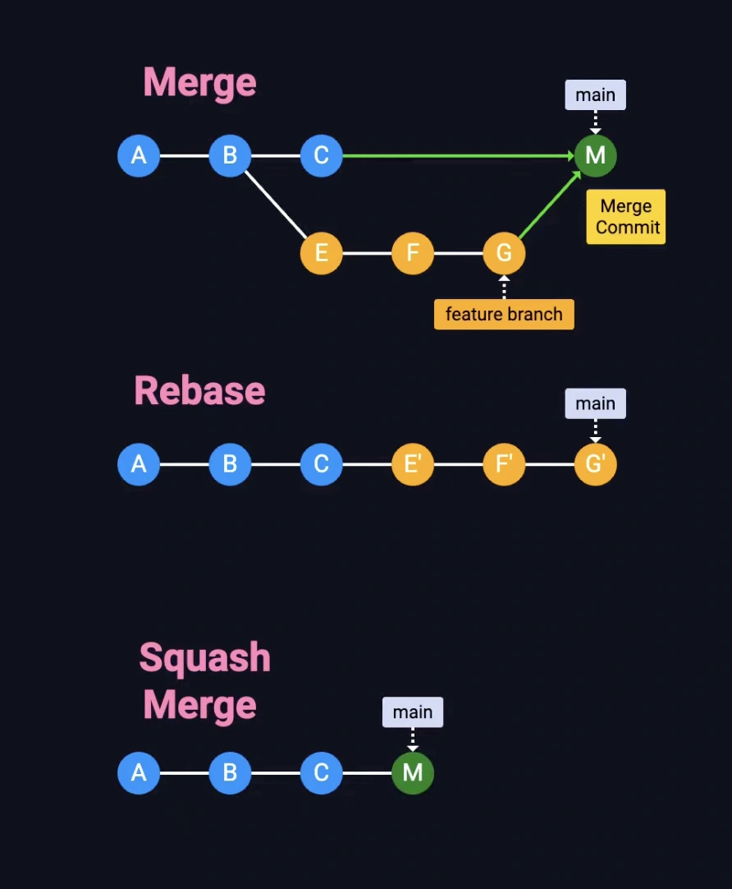

# Git

**Git is a distributed version control system (DVCS)** created by Linus Torvalds in 2005.

**Key Characteristics:**

| Feature | Description |
|---------|-------------|
| **Distributed** | Every developer has full repository history |
| **Fast** | Most operations are local |
| **Branching** | Cheap and easy branch creation |
| **Data Integrity** | Everything is checksummed (SHA-1) |
| **Non-linear Development** | Multiple parallel workflows |

<details>
<summary><strong>View contents</strong></summary>

**Real-World Analogy:**

```
Git is like Google Docs with time travel:
- Every save is a snapshot (commit)
- You can go back to any previous version
- Multiple people can work simultaneously
- Changes can be merged intelligently
```

</details>

---

## Git vs Other Version Control Systems

<details>
<summary><strong>View contents</strong></summary>

**Git vs SVN (Centralized VCS):**

| Feature | Git | SVN |
|---------|-----|-----|
| **Architecture** | Distributed | Centralized |
| **Offline Work** | ✅ Yes | ❌ No |
| **Speed** | Fast (local) | Slower (network) |
| **Branching** | Cheap | Expensive |
| **Storage** | Snapshots | Diffs |

**Why Git Won:**

```
✅ Distributed = No single point of failure
✅ Branching = Easy experimentation
✅ Fast = Local operations
✅ Popular = GitHub, GitLab, Bitbucket
```

</details>

---

## Git's Three States

**Working Directory → Staging Area → Repository**

```
┌─────────────────┐     ┌─────────────────┐      ┌─────────────────┐
│    Working      │     │    Staging      │      │   Repository    │
│   Directory     │────>│      Area       │─────>│   (.git dir)    │
│  (modified)     │ add │   (staged)      │commit│  (committed)    │
└─────────────────┘     └─────────────────┘      └─────────────────┘
```

<details>
<summary><strong>View contents</strong></summary>

**Example:**

```bash
# Modified (working directory)
echo "Hello" > file.txt

# Staged (staging area)
git add file.txt

# Committed (repository)
git commit -m "Add greeting"
```

</details>

---

## Practice Questions (Git history, states, etc.)

<details>
<summary><strong>View contents</strong></summary>

**Fill in the Blanks:**

1. Git is a __________ version control system, meaning every developer has a complete copy.
2. The three states of Git are: working directory, __________ area, and repository.
3. Git uses __________ hashing algorithm to ensure data integrity.
4. The `git add` command moves changes to the __________ area.

**True/False:**

1. ⬜ Git requires a central server to function
2. ⬜ Branching in Git is more expensive than in SVN
3. ⬜ Git stores snapshots, not diffs
4. ⬜ You can commit directly from working directory without staging

**Multiple Choice:**

1. What does the staging area allow you to do?
   - A) Delete files
   - B) Create commits selectively
   - C) Merge branches
   - D) Push to remote

---

### Answers

<details>
<summary><strong>View answers</strong></summary>

**Fill in the Blanks:**
1. distributed
2. staging
3. SHA-1
4. staging

**True/False:**
1. ❌ False (Git is distributed, works offline)
2. ❌ False (Git branching is cheap and fast)
3. ✅ True
4. ❌ False (must stage first with `git add`)

**Multiple Choice:**
1. **B** - Create commits selectively

</details>

</details>

---

## Configuration & Setup

### Initial Configuration

**Three Levels of Configuration:**

```bash
# System-wide (all users)
git config --system

# User-level (current user)
git config --global

# Repository-level (current repo only)
git config --local
```

**Priority:** Local > Global > System

---

### Essential Configuration

**User Identity (Required):**

```bash
# Global configuration
git config --global user.name "John Doe"
git config --global user.email "john@example.com"

# Per-repository configuration
git config user.name "John Work"
git config user.email "john@company.com"
```

**Why This Matters:**
- Commits are signed with this information
- Critical for collaboration and audit trails
- Cannot be changed in commit history (without rewriting)

---

### View Configuration

```bash
# List all settings
git config --list
git config -l

# Show where each setting comes from
git config --list --show-origin

# Get specific setting
git config user.name
git config user.email
```

<details>
<summary><strong>View contents</strong></summary>

**Example:**

```bash
# Check current configuration
$ git config -l

user.name=John Doe
user.email=john@example.com
core.editor=vim
color.ui=auto
push.default=simple
```

</details>

---

### Useful Configuration Options

<details>
<summary><strong>View contents</strong></summary>

**Default Branch Name:**

```bash
# Set default branch name for new repos
git config --global init.defaultBranch main
```

**Default Editor:**

```bash
# Set preferred text editor
git config --global core.editor "code --wait"  # VS Code
git config --global core.editor "vim"          # Vim
git config --global core.editor "nano"         # Nano
```

**Credential Caching:**

```bash
# Cache credentials for 15 minutes (default)
git config --global credential.helper cache

# Cache for 1 hour
git config --global credential.helper "cache --timeout=3600"

# Store credentials permanently (less secure)
git config --global credential.helper store
```

**Color Output:**

```bash
# Enable colored output
git config --global color.ui auto
```

**Aliases (Shortcuts):**

```bash
# Common aliases
git config --global alias.co checkout
git config --global alias.br branch
git config --global alias.ci commit
git config --global alias.st status
git config --global alias.unstage 'reset HEAD --'
git config --global alias.last 'log -1 HEAD'
git config --global alias.visual 'log --graph --oneline --all'

# Usage
git co main        # Same as: git checkout main
git ci -m "Fix"    # Same as: git commit -m "Fix"
git visual         # Beautiful commit graph
```

**Line Endings (Important for cross-platform teams):**

```bash
# Windows
git config --global core.autocrlf true

# Mac/Linux
git config --global core.autocrlf input
```

</details>

---

### Edit Configuration Files

```bash
# Edit global config
git config --global --edit

# Edit local config
git config --edit
```

<details>
<summary><strong>View contents</strong></summary>

**Manual Edit (Advanced):**

```bash
# Global config location
~/.gitconfig

# Example content:
[user]
    name = John Doe
    email = john@example.com
[core]
    editor = vim
[alias]
    co = checkout
    st = status
```

</details>

---

### SSH Key Setup (GitHub/GitLab)

<details>
<summary><strong>View contents</strong></summary>

**Generate SSH Key:**

```bash
# Generate new key
ssh-keygen -t ed25519 -C "your_email@example.com"

# Start SSH agent
eval "$(ssh-agent -s)"

# Add key to agent
ssh-add ~/.ssh/id_ed25519

# Copy public key to clipboard
cat ~/.ssh/id_ed25519.pub
# Add this to GitHub/GitLab settings
```

**Test Connection:**

```bash
# GitHub
ssh -T git@github.com

# GitLab
ssh -T git@gitlab.com
```

</details>

---

### Practice Questions (Configuration & setup)

<details>
<summary><strong>View contents</strong></summary>

**Fill in the Blanks:**

1. The __________ configuration level has the highest priority.
2. User identity is set with `git config user.name` and `git config user.__________`.
3. The `git config --__________` flag sets user-wide configuration.
4. Aliases are created with `git config alias.<name> '__________'`.

**True/False:**

1. ⬜ System configuration overrides global configuration
2. ⬜ Credential helper can cache passwords temporarily
3. ⬜ SSH keys are more secure than HTTPS passwords
4. ⬜ Line ending configuration is only important on Windows

**Multiple Choice:**

1. Which command shows where each config setting comes from?
   - A) `git config --list`
   - B) `git config --list --show-origin`
   - C) `git config --show-location`
   - D) `git config --verbose`

---

### Answers

<details>
<summary><strong>View answers</strong></summary>

**Fill in the Blanks:**
1. local
2. email
3. global
4. command

**True/False:**
1. ❌ False (Local > Global > System)
2. ✅ True
3. ✅ True
4. ❌ False (important for cross-platform teams)

**Multiple Choice:**
1. **B** - `git config --list --show-origin`

</details>

</details>

---

## Basic Operations

### Initialize a Repository

**New Repository:**

```bash
# Create new repo
mkdir myproject
cd myproject
git init

# With specific branch name
git init --initial-branch=main
```

<details>
<summary><strong>View contents</strong></summary>

**What happens:**

```
myproject/
└── .git/          # Git repository metadata
    ├── HEAD       # Points to current branch
    ├── config     # Repository config
    ├── objects/   # All commits, trees, blobs
    └── refs/      # Branch and tag references
```

**Clone Existing Repository:**

```bash
# HTTPS
git clone https://github.com/user/repo.git

# SSH
git clone git@github.com:user/repo.git

# Clone into specific directory
git clone https://github.com/user/repo.git mydir

# Clone specific branch
git clone -b develop https://github.com/user/repo.git
```

</details>

---

### Staging Files

**Add Files to Staging Area:**

```bash
# Stage single file
git add file.txt

# Stage multiple files
git add file1.txt file2.txt

# Stage all files
git add .
git add *

# Stage by pattern
git add *.js          # All JavaScript files
git add src/*.py      # All Python files in src/

# Stage all changes (including deletions)
git add -A
git add --all

# Interactive staging
git add -p file.txt   # Stage chunks interactively
```

<details>
<summary><strong>View contents</strong></summary>

**Real-World Example (Selective Staging):**

```bash
# You modified config.js and app.js
# Want to commit them separately

# Stage only config.js
git add config.js
git commit -m "Update configuration"

# Stage app.js
git add app.js
git commit -m "Add new feature"
```

</details>

---

### Check Repository Status

```bash
# Full status
git status

# Short status
git status -s
git status --short
```

<details>
<summary><strong>View contents</strong></summary>

**Status Output Explained:**

```bash
$ git status

On branch main
Your branch is up to date with 'origin/main'.

Changes to be committed:
  (use "git restore --staged <file>..." to unstage)
        modified:   file1.txt

Changes not staged for commit:
  (use "git add <file>..." to update what will be committed)
  (use "git restore <file>..." to discard changes in working directory)
        modified:   file2.txt

Untracked files:
  (use "git add <file>..." to include in what will be committed)
        file3.txt
```

**Short Status Symbols:**

```
?? - Untracked
A  - Added (staged new file)
M  - Modified (staged)
 M - Modified (not staged)
MM - Modified (staged and then modified again)
D  - Deleted (staged)
R  - Renamed
```

</details>

---

### Committing Changes

**Basic Commit:**

```bash
# Commit staged changes
git commit

# Commit with message
git commit -m "Add user authentication"

# Stage and commit tracked files
git commit -am "Fix login bug"
```

<details>
<summary><strong>View contents</strong></summary>

**Multi-line Commit Message:**

```bash
git commit -m "Short summary (50 chars or less)

Detailed explanation if needed. Wrap at 72 characters.
Explain WHAT changed and WHY, not HOW.

- Bullet points are okay
- Reference issues: Fixes #123"
```

**Good Commit Message Structure:**

```
<type>: <subject>

<body>

<footer>

Examples:
feat: Add user registration endpoint
fix: Resolve memory leak in image processing
docs: Update API documentation
refactor: Simplify authentication logic
test: Add unit tests for payment module
```

**Amend Last Commit:**

```bash
# Modify last commit message
git commit --amend -m "New message"

# Add forgotten files to last commit
git add forgotten_file.txt
git commit --amend --no-edit

# ⚠️ Warning: Only amend commits that haven't been pushed!
```

</details>

---

### Viewing Commit History

**Basic Log:**

```bash
# Full commit history
git log

# One line per commit
git log --oneline

# Limit number of commits
git log -3        # Last 3 commits
git log -n 5      # Last 5 commits
```

<details>
<summary><strong>View contents</strong></summary>

**Detailed Logs:**

```bash
# Show changes in each commit
git log -p
git log --patch

# Show statistics
git log --stat

# Show commit graph
git log --graph --oneline
git log --graph --oneline --all  # All branches

# Pretty format
git log --pretty=format:"%h - %an, %ar : %s"
# %h = short hash
# %an = author name
# %ar = relative date
# %s = subject
```

**Filter Commits:**

```bash
# By author
git log --author="John"

# By date
git log --since="2024-01-01"
git log --after="2 weeks ago"
git log --before="yesterday"

# By message
git log --grep="bug"

# By file
git log -- path/to/file.txt

# By content change
git log -S "function_name"  # Pickaxe
```

**Real-World Example:**

```bash
# Find who changed a specific function
git log -S "calculateTotal" --oneline

# Show commits from last week with stats
git log --since="1 week ago" --stat

# Beautiful graph of all branches
git log --graph --oneline --all --decorate
```

</details>

**Author Summary:**

```bash
# Commits per author
git shortlog -sne
# -s = summary
# -n = sort numerically
# -e = show email
```

---

### Viewing Changes

**Unstaged Changes:**

```bash
# All unstaged changes
git diff

# Specific file
git diff file.txt

# Specific directory
git diff src/
```

**Staged Changes:**

```bash
# Changes staged for commit
git diff --staged
git diff --cached
```

**Between Commits:**

```bash
# Compare commits
git diff commit1 commit2

# Compare branches
git diff main feature

# Compare with remote
git diff main origin/main
```

<details>
<summary><strong>View contents</strong></summary>

**Word-level Diff:**

```bash
# Show changes word-by-word
git diff --word-diff
```

**Real-World Example:**

```bash
# Before committing, review changes
git diff                    # Check working changes
git add .                   # Stage changes
git diff --staged           # Review staged changes
git commit -m "message"     # Commit

# Compare local with remote before pushing
git diff origin/main
```

</details>

---

### Removing Files

**Remove from Git and Filesystem:**

```bash
# Delete file
git rm file.txt
git commit -m "Remove file.txt"
```

**Remove from Git, Keep in Filesystem:**

```bash
# Stop tracking file
git rm --cached file.txt
git commit -m "Untrack file.txt"

# Common use case: Accidentally committed secrets
git rm --cached .env
echo ".env" >> .gitignore
git add .gitignore
git commit -m "Stop tracking .env file"
```

**Remove Directory:**

```bash
# Recursively remove
git rm -r --cached logs/
```

---

### Renaming/Moving Files

```bash
# Rename file
git mv old_name.txt new_name.txt

# Equivalent to:
mv old_name.txt new_name.txt
git rm old_name.txt
git add new_name.txt

# Move file
git mv file.txt src/file.txt
```

---

### Ignoring Files

**Create .gitignore:**

```bash
# .gitignore examples
*.log                  # Ignore all .log files
node_modules/          # Ignore directory
.env                   # Ignore specific file
!important.log         # Exception (don't ignore)
build/                 # Build output
*.class                # Java compiled files
__pycache__/           # Python cache
.DS_Store              # Mac OS files
```

<details>
<summary><strong>View contents</strong></summary>

**Common Patterns:**

```
# Dependencies
/node_modules
/vendor

# Build outputs
/dist
/build
*.o
*.exe

# Environment variables
.env
.env.local

# IDE files
.vscode/
.idea/
*.swp

# OS files
.DS_Store
Thumbs.db

# Logs
*.log
logs/
```

**Global Gitignore:**

```bash
# Create global ignore file
git config --global core.excludesfile ~/.gitignore_global

# Add common ignores
echo ".DS_Store" >> ~/.gitignore_global
echo "*.swp" >> ~/.gitignore_global
```

</details>

---

### Practice Questions (Basic operations)

<details>
<summary><strong>View contents</strong></summary>

**Fill in the Blanks:**

1. The `git __________` command moves files to the staging area.
2. To commit all tracked files without staging, use `git commit __________`.
3. The `git __________` command shows differences between working directory and staging area.
4. Files listed in `__________` are not tracked by Git.

**True/False:**

1. ⬜ `git add .` stages all changes including deletions
2. ⬜ `git commit --amend` should only be used on unpushed commits
3. ⬜ `git rm --cached` deletes files from the filesystem
4. ⬜ `.gitignore` can have exception rules using `!`

**Multiple Choice:**

1. Which command shows the commit history as a graph?
   - A) `git log --stat`
   - B) `git log --graph`
   - C) `git log --tree`
   - D) `git log --visual`

2. What does `git diff --staged` show?
   - A) Unstaged changes
   - B) Changes between commits
   - C) Staged changes ready to commit
   - D) Changes in remote repository

---

### Answers

<details>
<summary><strong>View answers</strong></summary>

**Fill in the Blanks:**
1. add
2. -am
3. diff
4. .gitignore

**True/False:**
1. ✅ True (use `git add -A` or `git add .`)
2. ✅ True (rewriting pushed commits causes problems)
3. ❌ False (only stops tracking, keeps file on disk)
4. ✅ True

**Multiple Choice:**
1. **B** - `git log --graph`
2. **C** - Staged changes ready to commit

</details>

</details>

---

## Branching & Merging

### Understanding Branches

**What is a Branch?**

```
A branch is a lightweight movable pointer to a commit.

main:     A---B---C
                   ↑
                  HEAD
```

**Default Branch Names:**
- **main** (modern standard)
- **master** (traditional, being phased out)

---

### Creating Branches

```bash
# Create new branch
git branch feature-login

# Create and switch
git checkout -b feature-login
git switch -c feature-login    # Modern alternative

# Create from specific commit
git branch bugfix abc1234
```

**Real-World Example:**

<details>
<summary><strong>View contents</strong></summary>

```bash
# Start new feature
git checkout -b feature/user-profile

# Work on feature
git add .
git commit -m "Add user profile page"

# More work...
git commit -m "Add profile edit functionality"
```

</details>

---

### Switching Branches

```bash
# Old way
git checkout branch-name

# New way (Git 2.23+)
git switch branch-name

# Create and switch
git switch -c new-branch
```

**Switch and Keep Uncommitted Changes:**

<details>
<summary><strong>View contents</strong></summary>

**Option 1: Stash**

```bash
# Save changes temporarily
git stash push -m "Work in progress"

# Switch branch
git switch other-branch

# Do work on other branch...

# Switch back
git switch original-branch

# Restore changes
git stash pop
```

**Option 2: Create New Branch**

```bash
# Create new branch with current changes
git switch -c new-feature-branch
git commit -am "WIP: New feature"
```

</details>

---

### Viewing Branches

```bash
# List local branches
git branch

# List all branches (local + remote)
git branch -a
git branch --all

# List remote branches only
git branch -r

# Show last commit on each branch
git branch -v

# Show merged branches
git branch --merged

# Show unmerged branches
git branch --no-merged
```

**Example Output:**

```bash
$ git branch -v

* main          abc1234 Update README
  feature-login def5678 Add login form
  bugfix-auth   ghi9012 Fix authentication bug
```

---

### Renaming Branches

```bash
# Rename current branch
git branch -m new-name
git branch -M new-name  # Force rename

# Rename other branch
git branch -m old-name new-name

# Rename on remote
git push origin :old-name new-name
git push origin -u new-name
```

**Real-World Example:**

```bash
# Rename master to main
git branch -m master main
git push origin -u main
git push origin --delete master
```

---

### Deleting Branches

**Local Branches:**

```bash
# Safe delete (only if merged)
git branch -d feature-branch

# Force delete (even if not merged)
git branch -D feature-branch
```

**Remote Branches:**

```bash
# Delete remote branch
git push origin --delete feature-branch
git push origin :feature-branch     # Alternative syntax
```

**Real-World Example:**

```bash
# After merging pull request
git switch main
git pull origin main
git branch -d feature-login
git push origin --delete feature-login
```

---

### Merging Branches

**Fast-Forward Merge:**

```
Before:
main:    A---B
              ↑
         feature: C---D

After:
main:    A---B---C---D
                     ↑
```

```bash
git checkout main
git merge feature-branch
```

**Three-Way Merge:**

```
Before:
main:    A---B---C
              ↑
         feature: D---E

After:
main:    A---B---C---F (merge commit)
              ↑     ↗
         feature: D---E
```

```bash
git checkout main
git merge feature-branch -m "Merge feature"
```

**No Fast-Forward (Always Create Merge Commit):**

<details>
<summary><strong>View contents</strong></summary>

```bash
git merge --no-ff feature-branch
```

**Why use --no-ff?**
- Preserves feature branch history
- Clear separation of features
- Easier to revert entire feature

</details>

---

### Merge Conflicts

**What Causes Conflicts?**

```
Same file, same location, different changes in two branches
```

**Conflict Markers:**

```
<<<<<<< HEAD (current branch)
Your changes
=======
Their changes
>>>>>>> feature-branch
```

**Resolving Conflicts:**

```bash
# 1. Start merge
git merge feature-branch
# Auto-merging file.txt
# CONFLICT (content): Merge conflict in file.txt

# 2. Check conflicted files
git status

# 3. Open file and resolve
# Remove conflict markers, keep desired code

# 4. Mark as resolved
git add file.txt

# 5. Complete merge
git commit
```

**Abort Merge:**

```bash
# Cancel merge and go back
git merge --abort
```

**Real-World Example:**

<details>
<summary><strong>View contents</strong></summary>

```bash
# config.js conflict
<<<<<<< HEAD
const API_URL = "http://localhost:3000"
=======
const API_URL = "https://api.production.com"
>>>>>>> feature-branch

# Resolution:
const API_URL = process.env.API_URL || "http://localhost:3000"

# Mark resolved
git add config.js
git commit -m "Merge feature-branch, resolve config conflict"
```

</details>

---

### Merge Tools

```bash
# Configure merge tool
git config --global merge.tool vimdiff

# Use merge tool
git mergetool

# Popular tools:
# - VS Code
# - Meld
# - KDiff3
# - P4Merge
```

---

### Rebase (Alternative to Merge)

**What is Rebase?**

```
Rebase replays commits on top of another branch

Before:
main:    A---B---C
              ↑
         feature: D---E

After rebase feature onto main:
main:    A---B---C
                  ↑
         feature:     D'---E'
```

**Basic Rebase:**

```bash
# Rebase feature onto main
git checkout feature-branch
git rebase main

# Or in one command
git rebase main feature-branch
```

**Interactive Rebase:**

```bash
# Rebase last 3 commits
git rebase -i HEAD~3

# Interactive options:
# pick   - use commit
# reword - use commit, but edit message
# edit   - use commit, but stop for amending
# squash - meld into previous commit
# fixup  - like squash, but discard message
# drop   - remove commit
```

**Real-World Example:**

```bash
# Clean up commits before pushing
git rebase -i HEAD~3

# Editor opens:
pick abc1234 WIP: Add feature
pick def5678 Fix typo
pick ghi9012 Add tests

# Change to:
pick abc1234 WIP: Add feature
fixup def5678 Fix typo
fixup ghi9012 Add tests

# Result: Single clean commit
```

**Rebase Conflicts:**

```bash
# During rebase conflict
git status
# Edit conflicted files
git add .
git rebase --continue

# Abort rebase
git rebase --abort
```

---

### Merge vs Rebase

| Merge | Rebase |
|-------|--------|
| Creates merge commit | Linear history |
| Preserves history | Rewrites history |
| Safe for shared branches | Dangerous for shared branches |
| Complex history graph | Clean, linear history |

**When to Use What:**

```bash
# ✅ Merge: Integrating shared branches
git merge main

# ✅ Rebase: Updating feature branch
git rebase main

# ✅ Rebase: Cleaning local commits
git rebase -i HEAD~3

# ❌ NEVER rebase published commits!
```

**Golden Rule of Rebasing:**

```
🚨 Never rebase commits that have been pushed to a shared repository!

Why? Other developers may have based work on those commits.
Rebasing rewrites history and causes conflicts for everyone.
```

---

### Cherry-Pick (Apply Specific Commits)

```bash
# Apply specific commit to current branch
git cherry-pick abc1234

# Apply multiple commits
git cherry-pick abc1234 def5678

# Cherry-pick without committing
git cherry-pick -n abc1234
```

**Use Case:**

```bash
# Hotfix from feature branch to main
git checkout main
git cherry-pick feature-abc123  # Just the bug fix
```

---

### Merge vs Rebase vs Squash



**source**: [ByteVigor](https://www.youtube.com/shorts/q-i-1wiIArg)

<details>
<summary><strong>View contents</strong></summary>

### Merge

**What it does**

* Combines two branches together.
* Preserves the **full commit history** of both branches.
* Creates a **merge commit** to mark the integration point.

**Result**

* History is **non-linear** (branches + merge commits).
* You can see exactly how and when branches diverged and rejoined.

**Pros**

* Complete and accurate history
* Safe for shared branches
* Best for teamwork and collaboration

**Cons**

* Commit history can become cluttered

**When to use**

* Merging a feature branch into `main`
* Working on shared or long-lived branches
* When history transparency matters

---

### Rebase

**What it does**

* Takes commits from one branch and **replays them on top of another**.
* Rewrites commit history (commits get new IDs).

**Result**

* A **clean, linear history**
* Looks as if the work was done directly on the target branch

**Pros**

* Easier to read commit history
* No extra merge commits

**Cons**

* Conflicts may need to be resolved multiple times
* **Dangerous on shared branches** because it rewrites history

**Important rule**

> **Never rebase a branch that others are already using**

**When to use**

* Cleaning up your own local feature branch
* Before merging a feature branch
* Solo work or private branches

---

### Squash (Squash Merge)

**What it does**

* Combines multiple commits into **one single commit**.
* Often used via **“Squash and Merge”** on GitHub/GitLab.

**Result**

* Very simple history
* One commit represents the entire feature

**Pros**

* Clean and readable history
* Ideal for small or messy commit series

**Cons**

* Loses individual commit details
* Harder to see development steps

**When to use**

* Feature branches with many “WIP” or small commits
* When only the final result matters

---

### Quick Comparison

| Method | History Style    | Safe for Shared Branches | Best Use Case              |
| ------ | ---------------- | ------------------------ | -------------------------- |
| Merge  | Non-linear       | ✅ Yes                    | Team collaboration         |
| Rebase | Linear           | ❌ No                     | Cleaning local history     |
| Squash | Linear & minimal | ✅ Yes                    | Simple feature integration |

---

#### Rule of Thumb

* **Merge** → teamwork & transparency
* **Rebase** → clean up *your own* work
* **Squash** → keep `main` simple and readable

</details>

### Practice Questions (Branch & Merging)

<details>
<summary><strong>View contents</strong></summary>

**Fill in the Blanks:**

1. The `git branch __________` command creates a new branch.
2. The modern command to switch branches is `git __________`.
3. A __________ merge creates a merge commit even if fast-forward is possible.
4. The __________ command rewrites commit history by replaying commits.

**True/False:**

1. ⬜ Fast-forward merge creates a merge commit
2. ⬜ You should never rebase public/shared branches
3. ⬜ `git stash` saves uncommitted changes temporarily
4. ⬜ Merge conflicts must be resolved manually

**Multiple Choice:**

1. Which command creates and switches to a new branch?
   - A) `git branch -c new-branch`
   - B) `git checkout -b new-branch`
   - C) `git switch new-branch`
   - D) `git create new-branch`

2. What does `git branch -d` do?
   - A) Deletes remote branch
   - B) Deletes local branch (safe)
   - C) Deletes local branch (force)
   - D) Deletes current branch

---

### Answers

<details>
<summary><strong>View answers</strong></summary>

**Fill in the Blanks:**
1. <branch-name>
2. switch
3. no-ff
4. rebase

**True/False:**
1. ❌ False (fast-forward moves pointer, no merge commit)
2. ✅ True (causes conflicts for others)
3. ✅ True
4. ✅ True (automatic merge fails on conflicts)

**Multiple Choice:**
1. **B** - `git checkout -b new-branch`
2. **B** - Deletes local branch (safe, only if merged)

</details>

</details>

---

## Remote Repositories

### Understanding Remotes

**What is a Remote?**

```
A remote is a version of your repository hosted on a server

Local Repo  ←→  Remote Repo (GitHub/GitLab/Bitbucket)
```

**Common Remote Names:**
- **origin** - Default remote (your fork)
- **upstream** - Original repository (when forking)

---

### Adding Remotes

```bash
# Add remote
git remote add origin https://github.com/user/repo.git

# Add multiple remotes
git remote add upstream https://github.com/original/repo.git

# With SSH
git remote add origin git@github.com:user/repo.git
```

**Real-World Example (Fork Workflow):**

<details>
<summary><strong>View contents</strong></summary>

```bash
# Clone your fork
git clone https://github.com/yourname/project.git
cd project

# Add original repo as upstream
git remote add upstream https://github.com/original/project.git

# Now you have:
# origin   → your fork
# upstream → original repo
```

</details>

---

### Viewing Remotes

```bash
# List remotes
git remote

# List with URLs
git remote -v

# Detailed info
git remote show origin
```

**Example Output:**

```bash
$ git remote -v

origin    https://github.com/user/repo.git (fetch)
origin    https://github.com/user/repo.git (push)
upstream  https://github.com/original/repo.git (fetch)
upstream  https://github.com/original/repo.git (push)
```

---

### Changing Remote URLs

```bash
# Change remote URL
git remote set-url origin https://github.com/user/new-repo.git

# Change to SSH
git remote set-url origin git@github.com:user/repo.git

# View current URL
git remote get-url origin
```

**Migration Example:**

```bash
# Moving from HTTPS to SSH
git remote -v
# origin  https://github.com/user/repo.git (fetch)

git remote set-url origin git@github.com:user/repo.git

git remote -v
# origin  git@github.com:user/repo.git (fetch)
```

---

### Removing Remotes

```bash
# Remove remote
git remote remove origin
git remote rm origin
```

---

### Fetching Changes

**Fetch downloads changes without merging:**

```bash
# Fetch from origin
git fetch origin

# Fetch all remotes
git fetch --all

# Fetch and prune deleted remote branches
git fetch --prune
git fetch -p
```

**What Fetch Does:**

```
Before fetch:
Local:  A---B---C (main)
Remote: A---B---C---D---E (origin/main)

After fetch:
Local:  A---B---C (main)
        A---B---C---D---E (origin/main)

Your branch is behind 'origin/main' by 2 commits
```

---

### Pulling Changes

**Pull = Fetch + Merge:**

```bash
# Pull from origin main
git pull origin main

# Pull current branch
git pull

# Pull with rebase
git pull --rebase
git pull -r
```

**Pull Strategies:**

```bash
# Default (merge)
git pull
# Creates merge commit

# Rebase
git pull --rebase
# Replays your commits on top

# Fast-forward only
git pull --ff-only
# Fails if fast-forward impossible
```

**Real-World Example:**

```bash
# Update feature branch with main
git checkout feature-branch
git pull origin main

# Or with rebase (cleaner history)
git pull --rebase origin main
```

---

### Pushing Changes

**Push local commits to remote:**

```bash
# Push to origin main
git push origin main

# Push current branch
git push

# Push and set upstream
git push -u origin feature-branch
git push --set-upstream origin feature-branch

# Force push (⚠️ dangerous!)
git push --force
git push -f

# Safe force push
git push --force-with-lease
```

**First Push of New Branch:**

```bash
# Create and push new branch
git checkout -b feature-login
git commit -am "Add login"
git push -u origin feature-login

# Next time just:
git push
```

**Force Push (When Necessary):**

```bash
# After rebasing private branch
git rebase -i HEAD~3
git push --force-with-lease

# ⚠️ NEVER force push to shared branches (main, develop)!
```

**Why --force-with-lease is Safer:**

```
--force-with-lease checks if remote changed since your last fetch
Prevents overwriting others' work
```

---

### Remote Branches

**List Remote Branches:**

```bash
# All branches
git branch -a

# Remote only
git branch -r

# Output example:
  main
  feature-login
  remotes/origin/main
  remotes/origin/feature-login
  remotes/origin/develop
```

**Track Remote Branch:**

```bash
# Create local branch tracking remote
git checkout -b feature origin/feature
git checkout --track origin/feature  # Shorter

# Or switch to remote branch directly (Git 2.23+)
git switch feature  # Automatically tracks origin/feature
```

**Delete Remote Branch:**

```bash
# Method 1
git push origin --delete feature-branch

# Method 2 (older syntax)
git push origin :feature-branch
```

---

### Syncing Fork with Upstream

<details>
<summary><strong>View contents</strong></summary>

**Complete Workflow:**

```bash
# 1. Add upstream remote (once)
git remote add upstream https://github.com/original/repo.git

# 2. Fetch upstream changes
git fetch upstream

# 3. Checkout your main branch
git checkout main

# 4. Merge upstream changes
git merge upstream/main

# 5. Push to your fork
git push origin main

# 6. Update feature branch
git checkout feature-branch
git rebase main
```

**Script Version:**

```bash
# Update fork script
git fetch upstream
git checkout main
git merge upstream/main
git push origin main
```

</details>

---

### Pull Requests / Merge Requests

**Workflow:**

```bash
# 1. Create feature branch
git checkout -b feature/add-search

# 2. Work and commit
git add .
git commit -m "Add search functionality"

# 3. Push to remote
git push -u origin feature/add-search

# 4. Create PR on GitHub/GitLab
# (via web interface)

# 5. Address review comments
git commit -am "Address review comments"
git push

# 6. After merge, clean up
git checkout main
git pull origin main
git branch -d feature/add-search
git push origin --delete feature/add-search
```

---

### Practice Questions (Remote repositories)

<details>
<summary><strong>View contents</strong></summary>

**Fill in the Blanks:**

1. The `git __________` command downloads changes without merging them.
2. The default remote name is usually __________.
3. `git push -u` sets the __________ tracking for a branch.
4. The `--__________` flag makes force push safer by checking remote state.

**True/False:**

1. ⬜ `git pull` is equivalent to `git fetch` followed by `git merge`
2. ⬜ Force pushing to shared branches is a good practice
3. ⬜ Remote branches are automatically deleted when deleted locally
4. ⬜ `git fetch` modifies your working directory

**Multiple Choice:**

1. Which command shows detailed information about a remote?
   - A) `git remote info origin`
   - B) `git remote show origin`
   - C) `git remote details origin`
   - D) `git info origin`

2. What does `git push -u origin main` do?
   - A) Updates remote main
   - B) Pushes and sets upstream tracking
   - C) Unsets upstream tracking
   - D) Pulls from origin main

---

### Answers

<details>
<summary><strong>View answers</strong></summary>

**Fill in the Blanks:**
1. fetch
2. origin
3. upstream
4. force-with-lease

**True/False:**
1. ✅ True
2. ❌ False (very dangerous, can lose others' work)
3. ❌ False (must explicitly delete: `git push origin --delete branch`)
4. ❌ False (only updates remote tracking branches)

**Multiple Choice:**
1. **B** - `git remote show origin`
2. **B** - Pushes and sets upstream tracking

</details>

</details>

---

## Advanced Topics

### Git Stash

**Save Work in Progress:**

```bash
# Save changes
git stash
git stash push

# Save with message
git stash push -m "WIP: Add payment feature"

# Include untracked files
git stash -u
git stash --include-untracked

# Stash specific files
git stash push -m "Config changes" config.json
```

**List Stashes:**

```bash
# List all stashes
git stash list

# Output:
stash@{0}: WIP on main: abc1234 Fix bug
stash@{1}: WIP on feature: def5678 Add feature
```

**Apply Stash:**

```bash
# Apply most recent stash
git stash apply

# Apply specific stash
git stash apply stash@{1}

# Apply and remove from stash list
git stash pop

# Apply to different branch
git stash branch new-branch
```

**View Stash Contents:**

```bash
# Show changes in stash
git stash show

# Show detailed diff
git stash show -p
git stash show stash@{1} -p
```

**Delete Stash:**

```bash
# Drop specific stash
git stash drop stash@{0}

# Clear all stashes
git stash clear
```

**Real-World Example:**

<details>
<summary><strong>View contents</strong></summary>

```bash
# Working on feature, urgent bug reported
git stash push -m "WIP: Feature half done"

# Fix bug
git checkout main
git checkout -b hotfix-critical
git commit -am "Fix critical bug"
git push origin hotfix-critical

# Back to feature
git checkout feature-branch
git stash pop
# Continue working...
```

</details>

---

### Git Tags

**What are Tags?**

```
Tags mark specific points in history (releases, versions)
```

**Lightweight Tags:**

```bash
# Create lightweight tag
git tag v1.0.0

# Tag specific commit
git tag v1.0.0 abc1234
```

**Annotated Tags (Recommended):**

```bash
# Create annotated tag
git tag -a v1.0.0 -m "Release version 1.0.0"

# Tag with detailed message
git tag -a v1.0.0 -m "Release 1.0.0

- Add user authentication
- Fix memory leaks
- Update documentation"
```

<details>
<summary><strong>View contents</strong></summary>

**List Tags:**

```bash
# All tags
git tag

# Filter tags
git tag -l "v1.*"

# Show tag details
git show v1.0.0
```

**Push Tags:**

```bash
# Push single tag
git push origin v1.0.0

# Push all tags
git push origin --tags

# Push annotated tags only
git push origin --follow-tags
```

**Delete Tags:**

```bash
# Delete local tag
git tag -d v1.0.0

# Delete remote tag
git push origin --delete v1.0.0
git push origin :refs/tags/v1.0.0
```

**Checkout Tag:**

```bash
# Checkout tag (detached HEAD)
git checkout v1.0.0

# Create branch from tag
git checkout -b hotfix-v1.0.0 v1.0.0
```

**Real-World Example:**

```bash
# Release workflow
git checkout main
git pull origin main

# Create release tag
git tag -a v2.1.0 -m "Release 2.1.0

Features:
- Add dark mode
- Improve performance
- Fix critical bugs"

# Push tag
git push origin v2.1.0

# Create GitHub release from tag
```

</details>

---

### Git Reflog

**What is Reflog?**

```
Reflog records updates to branch tips
Useful for recovering lost commits
```

**View Reflog:**

```bash
# Show reflog
git reflog

# Output:
abc1234 HEAD@{0}: commit: Add feature
def5678 HEAD@{1}: checkout: moving from main to feature
ghi9012 HEAD@{2}: pull: Fast-forward
```

<details>
<summary><strong>View contents</strong></summary>

**Recover Lost Commits:**

```bash
# Accidentally reset hard
git reset --hard HEAD~3
# Oh no! Lost 3 commits

# Find them in reflog
git reflog

# Restore
git reset --hard HEAD@{1}
# or
git reset --hard abc1234
```

**Real-World Example:**

```bash
# Oops, deleted branch
git branch -D feature-important

# Find last commit from branch
git reflog
# abc1234 HEAD@{5}: commit: Last commit on feature

# Recover branch
git checkout -b feature-important abc1234
```

</details>

---

### Git Submodules

**What are Submodules?**

```
Submodules allow you to keep a Git repository as a subdirectory of another
```

**Add Submodule:**

```bash
# Add submodule
git submodule add https://github.com/user/lib.git libs/lib

# Commit
git commit -m "Add lib submodule"
```

<details>
<summary><strong>View contents</strong></summary>

**Clone with Submodules:**

```bash
# Clone with submodules
git clone --recursive https://github.com/user/project.git

# Or after cloning
git submodule init
git submodule update
```

**Update Submodules:**

```bash
# Update all submodules
git submodule update --remote

# Update specific submodule
git submodule update --remote libs/lib
```

</details>

---

### Git Worktrees

**Multiple Working Directories:**

```bash
# Create worktree
git worktree add ../project-feature feature-branch

# Now you have:
# project/        → main branch
# project-feature → feature-branch

# List worktrees
git worktree list

# Remove worktree
git worktree remove ../project-feature
```

**Use Case:**

```bash
# Working on feature, need to fix bug
# Instead of stashing:

git worktree add ../project-hotfix main
cd ../project-hotfix
# Fix bug...
git commit -am "Fix bug"
git push

cd ../project
# Continue feature work
```

---

### Git Hooks

**What are Hooks?**

```
Scripts that run automatically on Git events
Located in .git/hooks/
```

**Common Hooks:**

```bash
# Client-side hooks
pre-commit       # Before commit
prepare-commit-msg
commit-msg       # After commit
post-commit
pre-push         # Before push

# Server-side hooks
pre-receive
update
post-receive
```

<details>
<summary><strong>View contents</strong></summary>

**Example Pre-Commit Hook:**

```bash
# .git/hooks/pre-commit
#!/bin/sh

# Run tests before commit
npm test

# Run linter
npm run lint

# If any fail, commit is aborted
```

**Make Hook Executable:**

```bash
chmod +x .git/hooks/pre-commit
```

</details>

---

### Git Bisect (Find Bug-Introducing Commit)

**Binary Search for Bugs:**

```bash
# Start bisect
git bisect start

# Mark current commit as bad
git bisect bad

# Mark known good commit
git bisect good abc1234

# Git checks out middle commit
# Test the commit
# If bug exists:
git bisect bad
# If no bug:
git bisect good

# Repeat until Git finds the commit
# Git will output: "abc1234 is the first bad commit"

# End bisect
git bisect reset
```

**Automated Bisect:**

```bash
# Run automated test
git bisect start HEAD abc1234
git bisect run npm test

# Git automatically finds bad commit
```

---

## Troubleshooting & Recovery

### Undoing Changes

<details>
<summary><strong>View contents</strong></summary>

**Unstage Files:**

```bash
# Unstage file
git restore --staged file.txt
git reset HEAD file.txt  # Old way
```

**Discard Working Changes:**

```bash
# Discard changes in file
git restore file.txt
git checkout -- file.txt  # Old way

# Discard all changes
git restore .
```

**Undo Last Commit (Keep Changes):**

```bash
# Keep changes in staging
git reset --soft HEAD~1

# Keep changes in working directory
git reset HEAD~1
git reset --mixed HEAD~1

# Discard changes completely
git reset --hard HEAD~1
```

**Undo Multiple Commits:**

```bash
# Undo last 3 commits
git reset HEAD~3

# Undo and keep changes
git reset --soft HEAD~3
```

</details>

---

### Recovering Deleted Commits

<details>
<summary><strong>View contents</strong></summary>

**Using Reflog:**

```bash
# Find deleted commit
git reflog

# Restore
git cherry-pick abc1234
# or
git reset --hard abc1234
```

</details>

---

### Fixing Commit Messages

<details>
<summary><strong>View contents</strong></summary>

**Last Commit:**

```bash
# Change last commit message
git commit --amend -m "Correct message"
```

**Older Commits:**

```bash
# Interactive rebase
git rebase -i HEAD~3

# Change 'pick' to 'reword' for commits to edit
# Save and close
# Editor opens for each commit
```

</details>

---

### Removing Sensitive Data

<details>
<summary><strong>View contents</strong></summary>

**Remove File from History:**

```bash
# Using filter-branch (old method)
git filter-branch --tree-filter 'rm -f passwords.txt' HEAD

# Using BFG (recommended)
# Download BFG: https://rtyley.github.io/bfg-repo-cleaner/
bfg --delete-files passwords.txt
git reflog expire --expire=now --all
git gc --prune=now --aggressive

# Push force
git push --force
```

**Remove Secrets from Last Commit:**

```bash
# Remove file
git rm --cached .env
git commit --amend --no-edit

# Add to .gitignore
echo ".env" >> .gitignore
git add .gitignore
git commit -m "Add .env to gitignore"
```

</details>

---

### Resolving Detached HEAD

**What is Detached HEAD?**

```
HEAD points to specific commit instead of branch
Happens when checking out commits, tags
```

**Fix:**

```bash
# If you want to keep changes
git checkout -b new-branch

# If you don't want changes
git checkout main
```

---

### Fixing Merge Conflicts

<details>
<summary><strong>View contents</strong></summary>

**Complete Workflow:**

```bash
# 1. Start merge
git merge feature-branch
# CONFLICT in file.txt

# 2. Check status
git status

# 3. View conflict
cat file.txt
<<<<<<< HEAD
Current branch code
=======
Feature branch code
>>>>>>> feature-branch

# 4. Edit file, remove markers, keep desired code

# 5. Stage resolved file
git add file.txt

# 6. Complete merge
git commit

# OR abort
git merge --abort
```

</details>

---

### Pull/Push Conflicts

<details>
<summary><strong>View contents</strong></summary>

**Pull Rejected:**

```bash
# Error: Your local branch is behind
git pull origin main

# Or with rebase
git pull --rebase origin main
```

**Push Rejected:**

```bash
# Error: Updates were rejected
# Someone pushed while you were working

# Pull first
git pull origin main

# Resolve conflicts if any
# Then push
git push origin main
```

</details>

---

## Best Practices

### Commit Message Guidelines

**Format:**

```
<type>(<scope>): <subject>

<body>

<footer>
```

**Types:**

```
feat:     New feature
fix:      Bug fix
docs:     Documentation only
style:    Formatting, missing semicolons, etc.
refactor: Code change that neither fixes a bug nor adds a feature
test:     Adding missing tests
chore:    Maintain, dependency updates
```

**Examples:**

```bash
# Good
git commit -m "feat(auth): Add OAuth2 authentication

Implement OAuth2 flow for Google and GitHub
Add redirect handling and token refresh
Update documentation

Closes #123"

# Bad
git commit -m "fix"
git commit -m "changes"
git commit -m "Updated files"
```

**Rules:**

```
✅ Use imperative mood ("Add" not "Added")
✅ Keep subject under 50 characters
✅ Capitalize subject line
✅ Don't end subject with period
✅ Wrap body at 72 characters
✅ Explain what and why, not how
```

---

### Branching Strategy

**Git Flow:**

```
main        → Production-ready code
develop     → Integration branch
feature/*   → New features
release/*   → Release preparation
hotfix/*    → Emergency fixes
```

**GitHub Flow (Simpler):**

```
main        → Always deployable
feature/*   → Short-lived feature branches
```

**Branch Naming:**

```bash
# Good
feature/user-authentication
feature/add-payment-gateway
bugfix/fix-login-error
hotfix/security-patch

# Bad
test
new-feature
branch1
```

---

### .gitignore Best Practices

**Structure:**

```bash
# OS generated files
.DS_Store
Thumbs.db

# IDE files
.vscode/
.idea/
*.swp

# Dependencies
node_modules/
vendor/

# Build outputs
dist/
build/
*.o

# Environment variables
.env
.env.local

# Logs
*.log
logs/

# Database
*.sqlite
*.db
```

**Templates:**

```
Use gitignore.io or GitHub templates
https://github.com/github/gitignore
```

---

### Security Best Practices

```bash
# ✅ Do
- Use SSH keys, not passwords
- Review changes before committing
- Never commit secrets (.env, keys)
- Use .gitignore properly
- Enable 2FA on Git hosting

# ❌ Don't
- Commit API keys, passwords
- Commit large binary files
- Force push to shared branches
- Rewrite public history
```

---

### Performance Tips

```bash
# Shallow clone (faster)
git clone --depth 1 https://github.com/user/repo.git

# Sparse checkout (partial clone)
git sparse-checkout init
git sparse-checkout set dir1 dir2

# Clean up
git gc
git prune
```

---

## Interview Questions

### Q1: Explain the difference between `git pull` and `git fetch`.

**Answer:**

<details>
<summary><strong>View answer</strong></summary>

```
git fetch:
- Downloads changes from remote
- Does NOT merge into local branch
- Safe, non-destructive

git pull:
- Downloads changes from remote
- Automatically merges into local branch
- Equivalent to: git fetch + git merge
- Can cause conflicts
```

**Example:**

```bash
# fetch (safe)
git fetch origin
git log origin/main  # Review changes
git merge origin/main  # Merge when ready

# pull (fast)
git pull origin main  # Fetch + merge in one command
```

</details>

---

### Q2: What's the difference between `git merge` and `git rebase`?

**Answer:**

<details>
<summary><strong>View answer</strong></summary>

**Merge:**
- Creates merge commit
- Preserves history
- Non-destructive
- Complex history graph

```
main:    A---B---C---F (merge commit)
              ↑     ↗
         feature: D---E
```

**Rebase:**
- Replays commits
- Linear history
- Rewrites history
- Clean, simple graph

```
main:    A---B---C
                  ↑
         feature:     D'---E'
```

**When to use:**

```
Merge: Integrating public/shared branches
Rebase: Updating private feature branches
```

</details>

---

### Q3: How do you undo a commit that has been pushed?

**Answer:**

<details>
<summary><strong>View answer</strong></summary>

**Option 1: Revert (Safe, Recommended)**

```bash
# Creates new commit that undoes changes
git revert abc1234
git push origin main
```

**Option 2: Reset + Force Push (Dangerous)**

```bash
# Only for private branches!
git reset --hard HEAD~1
git push --force origin branch-name
```

**When to use:**

```
Revert:
✅ Shared branches (main, develop)
✅ Public commits
✅ Safe option

Reset + Force Push:
⚠️ Private branches only
⚠️ When history rewriting is acceptable
```

</details>

---

### Q4: What is a detached HEAD and how do you fix it?

**Answer:**

<details>
<summary><strong>View answer</strong></summary>

**Detached HEAD** = HEAD points to specific commit, not a branch

**Happens when:**
- `git checkout abc1234` (commit hash)
- `git checkout v1.0.0` (tag)

**Fix:**

```bash
# If you want to keep changes
git checkout -b new-branch-name

# If you don't want changes
git checkout main
```

</details>

---

### Q5: How do you resolve merge conflicts?

**Answer:**

<details>
<summary><strong>View answer</strong></summary>

**Complete Process:**

```bash
# 1. Merge attempt
git merge feature-branch
# CONFLICT in file.txt

# 2. Check conflicted files
git status

# 3. Open file, see conflict markers
<<<<<<< HEAD
Current code
=======
Feature code
>>>>>>> feature-branch

# 4. Edit file, keep desired code, remove markers

# 5. Stage resolved file
git add file.txt

# 6. Complete merge
git commit -m "Merge feature-branch, resolve conflicts"

# OR abort entire merge
git merge --abort
```

</details>

---

### Q6: What is git stash and when would you use it?

**Answer:**

<details>
<summary><strong>View answer</strong></summary>

**Git stash** temporarily saves uncommitted changes

**Use Cases:**

```bash
# Scenario 1: Switch branches without committing
git stash
git checkout other-branch
# Do work...
git checkout original-branch
git stash pop

# Scenario 2: Pull with uncommitted changes
git stash
git pull
git stash pop

# Scenario 3: Save multiple work-in-progress
git stash push -m "WIP: Feature A"
git stash push -m "WIP: Feature B"
git stash list
```

</details>

---

### Q7: How do you recover a deleted branch?

**Answer:**

<details>
<summary><strong>View answer</strong></summary>

**Using reflog:**

```bash
# 1. Find deleted branch in reflog
git reflog
# abc1234 HEAD@{5}: commit (feature-branch): Last commit

# 2. Recreate branch
git checkout -b feature-branch abc1234

# OR
git branch feature-branch abc1234
```

</details>

---

### Q8: What is the difference between `git reset --soft`, `--mixed`, and `--hard`?

**Answer:**

<details>
<summary><strong>View answer</strong></summary>

```bash
# --soft: Undo commit, keep staged changes
git reset --soft HEAD~1
# Changes remain in staging area

# --mixed (default): Undo commit, unstage changes
git reset HEAD~1
git reset --mixed HEAD~1
# Changes remain in working directory

# --hard: Undo commit, discard all changes
git reset --hard HEAD~1
# Changes completely removed (⚠️ dangerous!)
```

**Visual:**

```
Commit:    [X]
Staging:   [X] --soft--> [Staged]
Working:   [X] --mixed-> [Unstaged] --hard--> [Gone]
```

</details>

---

### Q9: What are Git hooks and how would you use them?

**Answer:**

<details>
<summary><strong>View answer</strong></summary>

**Git hooks** are scripts that run automatically on Git events

**Common Hooks:**

```bash
pre-commit      # Before commit (run tests, linting)
commit-msg      # Validate commit message
pre-push        # Before push (run full test suite)
post-receive    # After push (deploy to server)
```

**Example (pre-commit):**

```bash
#!/bin/sh
# .git/hooks/pre-commit

# Run tests
npm test || exit 1

# Run linter
npm run lint || exit 1

echo "All checks passed!"
```

**Make executable:**

```bash
chmod +x .git/hooks/pre-commit
```

</details>

---

### Q10: Explain Git rebase interactive and its use cases.

**Answer:**

<details>
<summary><strong>View answer</strong></summary>

**Interactive rebase** allows editing commit history

**Commands:**

```bash
pick    # Use commit
reword  # Edit commit message
edit    # Amend commit
squash  # Combine with previous
fixup   # Like squash, discard message
drop    # Remove commit
```

**Example:**

```bash
# Clean up last 3 commits
git rebase -i HEAD~3

# Before:
pick abc1234 WIP: Feature
pick def5678 Fix typo
pick ghi9012 Add tests

# After:
pick abc1234 WIP: Feature
fixup def5678 Fix typo
fixup ghi9012 Add tests

# Result: One clean commit
```

**Use Cases:**

```
✅ Clean up commits before PR
✅ Combine related commits
✅ Fix commit messages
✅ Remove sensitive data

❌ Never on public commits!
```

</details>

---
